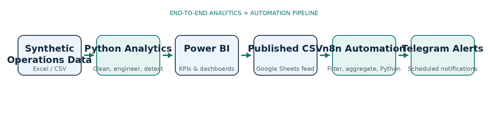
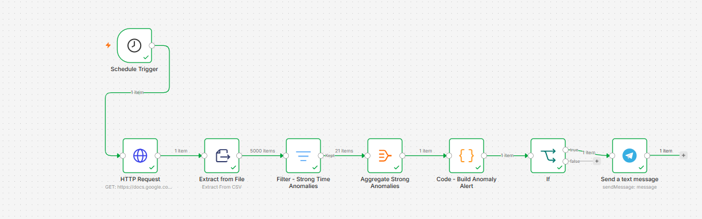

# AnnotateIQ
## AI-Powered Annotation Quality & Operations Intelligence Platform

> **Public portfolio showcase only.** The implementation repository, full datasets, Power BI source file, notebooks, automation export, credentials, and operational configuration are intentionally private.

AnnotateIQ is an end-to-end analytics and automation project designed to monitor AI data-annotation operations across **quality, productivity, SLA performance, anomaly detection, and project economics**.

The project combines **Python, Power BI, n8n, and Telegram** to transform operational records into decision-ready analytics and automated alerts.

## What the project demonstrates

- Data cleaning and validation of realistic annotation-operation records
- KPI design with explicit business definitions
- Quality analysis using initial QA reviews rather than post-rework outcomes
- Workload-normalized anomaly detection
- Operational and financial analysis
- Interactive Power BI reporting
- Automated daily monitoring with n8n
- Conditional Telegram alerts for strong anomalies

## Selected results

| Metric | Result |
|---|---:|
| Unique tasks analyzed | 5,000 |
| QA review records | 5,996 |
| Annotators | 28 |
| Projects | 5 |
| Completion rate | 98.87% |
| SLA compliance | 99.30% |
| Initial quality score | 92.91% |
| Average cycle time | 9.72 hours |
| Rework rate | 31.96% |
| Rejection rate | 0.31% |
| Strong time anomalies identified | 21 |

## Analytical approach

The synthetic dataset intentionally contains operational and data-quality issues such as duplicates, missing values, inconsistent categories, workload pressure, reviewer effects, and unusual processing times.

The analysis pipeline standardizes the data, preserves auditability through imputation and anomaly flags, and evaluates processing-time anomalies using both **total processing time** and **time per input unit**. A case is treated as a strong time anomaly only when both signals are unusually high.

## Business intelligence layer

The Power BI solution includes four analytical views:

1. **Executive Overview** - operational, SLA, quality, and financial KPIs
2. **Performance Trends** - completion trends and project performance
3. **Quality & Operations** - rework, rejection, error, and anomaly analysis
4. **Financial & Project Analysis** - revenue, labor cost, profit, and margin analysis

## Automation layer

The production-style monitoring workflow retrieves the latest analytical feed, extracts and filters strong anomalies, aggregates affected cases, builds the alert text in Python, checks whether anomalies exist, and sends a Telegram alert only when action is required.

The published workflow is scheduled to run daily and uses a conditional branch so that no Telegram message is sent when the anomaly count is zero.

## Technology stack

**Python / pandas / NumPy** - cleaning, feature engineering, KPI preparation, anomaly analysis  
**Power BI / DAX / Power Query** - interactive business intelligence  
**n8n** - scheduled workflow automation  
**Telegram Bot API** - automated operational alerts  
**Excel / CSV** - synthetic operational data layer

## Full case study

A detailed project case study is available here:

**[AnnotateIQ Project Case Study (PDF)](docs/AnnotateIQ_Project_Case_Study.pdf)**

## Repository scope and intellectual property

This repository is deliberately a **showcase repository**, not the implementation repository.

The following materials are **not published**:

- Full Python notebooks and source logic
- Complete synthetic dataset and cleaned analytical tables
- Power BI `.pbix` source file
- n8n workflow JSON export
- Credentials, tokens, API keys, chat IDs, and account configuration
- Internal working files and intermediate analytical outputs

These materials can be demonstrated privately during an interview or technical review when appropriate.

## Data note

All project data is synthetic and was created for portfolio demonstration. No real customer, worker, or proprietary company data is included in this public showcase.

---

**Project owner:** Rawan Abu Hattab  
**Portfolio project - 2026**

Copyright © 2026 Rawan Abu Hattab. All rights reserved. No license is granted for copying, redistribution, commercial reuse, or derivative implementation of the project materials contained in this repository.
